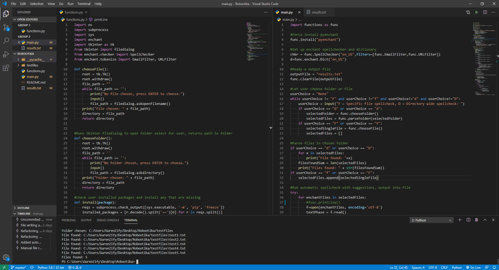
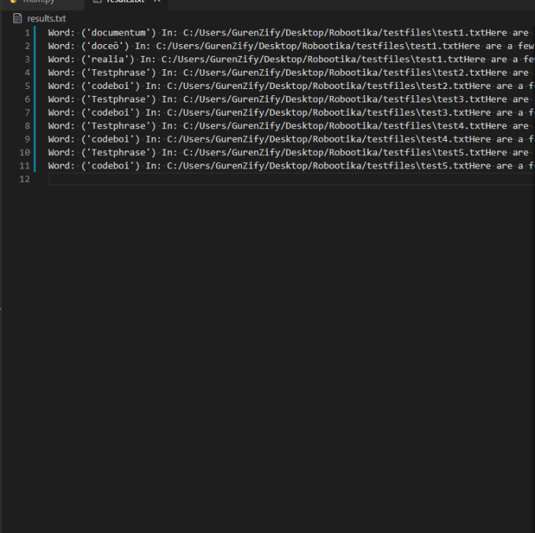

# Õigekirja kontroll

###### Kood kontrollib automaatselt kasutaja valitud faili või kaustas olevate failide õigekirja.

Kasutamiseks vajalik: Puthon 3+, pip, ülejäänud dependancy tõmmatakse automaatselt.
Kood on jaotatud kahte tükki:
1. Esimene fail, functions.py, hoiab dependacy installimise ja failide ning kaustade valiku koodi. Samuti väljundi tekitamise ja lisafunktsioonid leiab siit.
2. Teine fail, main.py, hoiab peaprotsessi, millega faile kontrollitakse. Olemas on mõlemad automaatne ja manuaalne kontroll. Automaatne kontroll käib läbi PyEnchant mooduli ning manuaalne läbi koodiga teksti filtreerimise.
Programmi väljund on tekstifail results.txt, mis genereeritakse automaatselt, kuhu kirjutatakse valed sõnad ja millisest failist neid võimalik leida on. Juhul kui sõnu pole jääb fail tühjaks.

